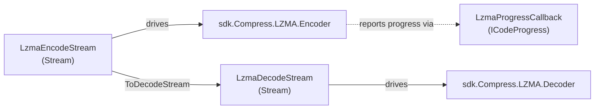

---
digest:
  local-classes:
    LzmaDecodeStream:
      mtime: "2026-08-06T07:02:34Z"
      digest: "aaf482e4e1899a7a54e713f187885de07863eb02dcff968bf738a582badde2a0"
    LzmaEncodeStream:
      mtime: "2026-08-06T07:02:34Z"
      digest: "55a8a71e703d311fe72a666aa61e91672a94f13a7bc91ba49599fa318613e8a7"
    LzmaProgressCallback:
      mtime: "2026-08-06T06:59:29Z"
      digest: "d52e5afa51eaa5b99c848bfc9f78ba7985d6635d2aebd99ada8c7d42e65ae155"
  folders: {}
---
# LZMA

This folder provides `LzmaEncodeStream`, `LzmaDecodeStream`, `LzmaProgressCallback` and related types. `LzmaEncodeStream` the stream which compresses data with LZMA on the fly.

## Classes

| Class | Responsibility | Key Collaborators |
|---|---|---|
| [LzmaDecodeStream](LzmaDecodeStream.cs) | The stream which decompresses data with LZMA on the fly. | `MemoryStream`, `Decoder`, `SeekOrigin` |
| [LzmaEncodeStream](LzmaEncodeStream.cs) | The stream which compresses data with LZMA on the fly. |  |
| [LzmaProgressCallback](LzmaProgressCallback.cs) | Callback to implement the ICodeProgress interface |  |

## Architecture

Thin `System.IO.Stream` adapters over the vendored `sdk/Compress/LZMA`
`Encoder`/`Decoder`, letting callers compress/decompress on the fly without
buffering a whole archive. Both streams split data into size-prefixed chunks
so `LzmaEncodeStream` output can be read back by `LzmaDecodeStream`.

