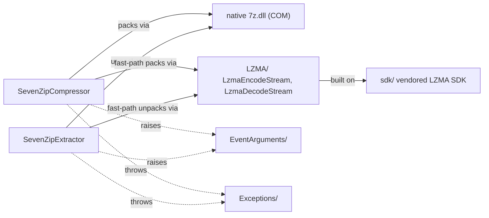

---
digest:
  local-classes:
    ArchiveEmulationStreamProxy:
      mtime: "2026-08-06T07:02:34Z"
      digest: "b14a9fa6fab6a41dc1f0a6e8e63855885fd7a5eda9ac54f12e57337c682f00d3"
    LibraryFeature:
      mtime: "2026-08-06T06:59:29Z"
      digest: "5589d311440652e581fbcb84a7cce5df4f554c81ab94106f8a42bb611fe69bf0"
    SevenZipCompressor:
      mtime: "2026-08-06T06:59:49Z"
      digest: "18c86e8dfe6787af1c88517afc8511e99655e40bf1b0eeaf51a7dcdbe248d6d3"
    SevenZipExtractor:
      mtime: "2026-08-06T06:59:49Z"
      digest: "7d2cdcccb7dadd2da9a8055bba8d94331a13ba54d26c520a70ae7f1cb6468524"
  folders: {}
---
# SevenZip

This folder provides `SevenZipCompressor`, `LibraryFeature`, `ArchiveEmulationStreamProxy` and related types. `SevenZipCompressor` asynchronous (Begin*/*Async) overloads of SevenZipCompressor's pack and modify operations.

## Classes

| Class | Responsibility | Key Collaborators |
|---|---|---|
| [ArchiveEmulationStreamProxy](ArchiveEmulationStreamProxy.cs) | The Stream extension class to emulate the archive part of a stream. |  |
| [LibraryFeature](LibraryFeature.cs) | The set of features supported by the library. |  |
| [SevenZipCompressor](SevenZipCompressor.cs) | Class to pack data into archives supported by 7-Zip. | `Encoder`, `EventHandler`, `ProgressEventArgs` |
| [SevenZipCompressor](SevenZipCompressorAsynchronous.cs) | Asynchronous (Begin*/*Async) overloads of SevenZipCompressor's pack and modify operations. |  |
| [SevenZipExtractor](SevenZipExtractor.cs) | Class to unpack data from archives supported by 7-Zip. | `EventHandler`, `ProgressEventArgs` |
| [SevenZipExtractor](SevenZipExtractorAsynchronous.cs) | Asynchronous (Begin*/*Async) overloads of SevenZipExtractor's unpack operations. |  |

## Subsystems

| Folder | Domain Role |
|---|---|
| [`EventArguments/`](EventArguments/ReadMe.md) | This folder provides `FileInfoEventArgs`, `ICancellable`, `PercentDoneEventArgs` and related types. |
| [`Exceptions/`](Exceptions/ReadMe.md) | This folder provides `SevenZipException`, `LzmaException`, `SevenZipSfxValidationException` and related types. |
| [`LZMA/`](LZMA/ReadMe.md) | This folder provides `LzmaEncodeStream`, `LzmaDecodeStream`, `LzmaProgressCallback` and related types. |
| [`sdk/`](sdk/ReadMe.md) | This folder provides `CoderPropId`, `DataErrorException`, `InvalidParamException` and related types. |

## Architecture

`SevenZipCompressor` and `SevenZipExtractor` are the library's two public entry
points; both wrap the native `7z.dll` via COM for general archive formats and,
for the 7z/LZMA-only fast path, drive the fully managed `LZMA/LzmaEncodeStream`
and `LzmaDecodeStream`, which in turn sit on top of `sdk/`'s vendored LZMA SDK.
Long-running operations raise `EventArguments/` events (`FileInfoEventArgs`,
`ProgressEventArgs`, ...) that support cooperative cancellation via
`ICancellable`; failures surface as `Exceptions/` types.

## Entry Points

- [`SevenZipCompressor`](SevenZipCompressor.cs) — pack/update archives; async overloads in [`SevenZipCompressorAsynchronous.cs`](SevenZipCompressorAsynchronous.cs).
- [`SevenZipExtractor`](SevenZipExtractor.cs) — extract/list archives; async overloads in [`SevenZipExtractorAsynchronous.cs`](SevenZipExtractorAsynchronous.cs).

