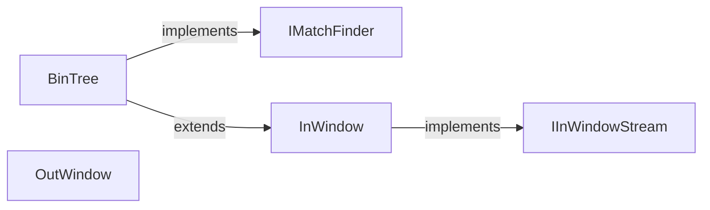

---
digest:
  local-classes:
    BinTree:
      mtime: "2026-08-06T06:59:49Z"
      digest: "9f21df72c73e33c8e093e9180d23fbb202e7884fd2f3f5db287250c3d09d363a"
    IInWindowStream:
      mtime: "2026-08-06T06:59:49Z"
      digest: "f541f389fdafe883a2b5f26d6b7cd3469749b7d07ec7dfeae87951e832515b5c"
    IMatchFinder:
      mtime: "2026-08-06T06:59:49Z"
      digest: "23a189417cb4a2ec4844c241f2e13441f836db3f59dcedabd15aadde035829ea"
    InWindow:
      mtime: "2026-08-06T07:02:34Z"
      digest: "69b3261a8ab707ba88efcf40bef53b843c2f737aa003eaaa86ff446275843136"
    OutWindow:
      mtime: "2026-08-06T06:59:49Z"
      digest: "e1f966b02d28e62312733a1190c05e7955e6ec8bd8f4cc2ed90f245a5c7a7de6"
  folders: {}
---
# LZ

This folder provides `BinTree`, `InWindow`, `OutWindow` and related types. `BinTree` binary-tree match finder that locates the longest previous occurrence of the  current byte sequence within the sliding InWindow, for LZ77-style  back-reference selection during LZMA encoding.

## Classes

| Class | Responsibility |
|---|---|
| [IInWindowStream](IMatchFinder.cs) | Abstraction over a sliding input buffer that gives byte-level lookback/lookahead   access to the data being compressed or decompressed. |
| [IMatchFinder](IMatchFinder.cs) | Finds previous occurrences of the byte sequence at the current position within the   sliding window, so the encoder can emit LZ77-style back-references. |
| [BinTree](LzBinTree.cs) | Binary-tree match finder that locates the longest previous occurrence of the  current byte sequence within the sliding InWindow, for LZ77-style  back-reference selection during LZMA encoding. |
| [InWindow](LzInWindow.cs) | Input window class |
| [OutWindow](LzOutWindow.cs) | Sliding output window that buffers decompressed bytes in memory so LZ77 back-  references can copy from recent output, flushing completed data to the destination stream. |

## Architecture

`InWindow` is the shared sliding read-window base; `BinTree` extends it with a
binary-tree hash index to implement `IMatchFinder`, letting the LZMA encoder
look up the best back-reference for the current position. `OutWindow` is the
decoder-side counterpart, replaying back-references from recently written
output. `IInWindowStream` is the minimal streaming contract both windows expose
to the coders in `../LZMA`.

