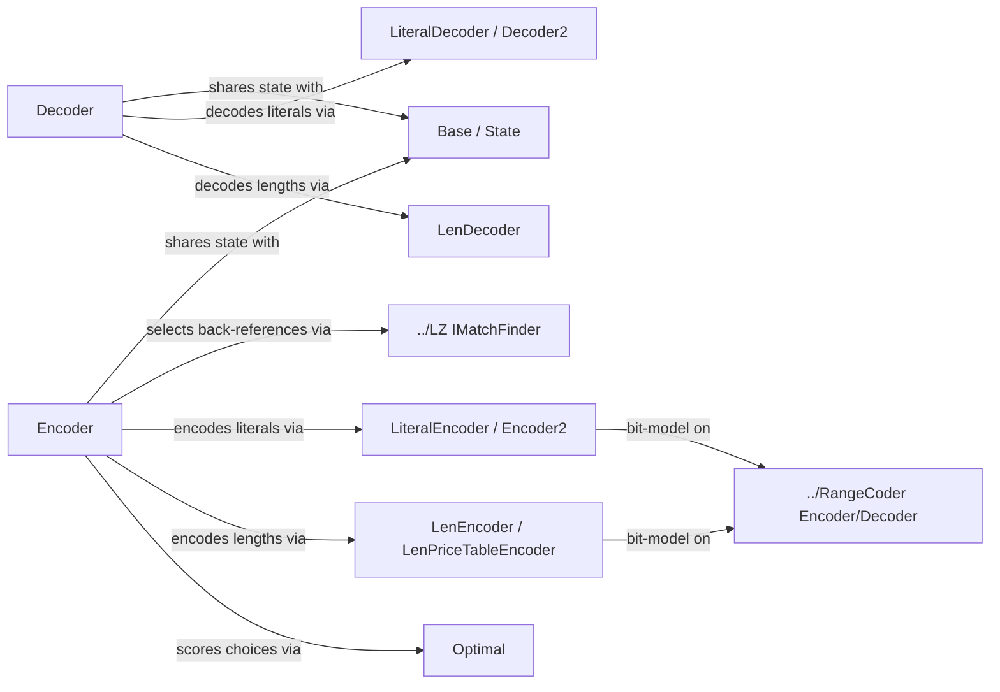

---
digest:
  local-classes:
    Base:
      mtime: "2026-08-06T06:59:49Z"
      digest: "4c7e2d603cf58dea7207ff58ef9f9bce5284c25c04d4e2c176c01146e998d2e0"
    Decoder:
      mtime: "2026-08-06T07:02:34Z"
      digest: "bde535cd7ada2052eac9130fe51370110afdfd837121af38e3d90e4f11d2837a"
    Decoder2:
      mtime: "2026-08-06T07:02:34Z"
      digest: "1c9dc232792ca5edeb65b7f9fc7e1fda3e426bf139280842ddd66f63f1386975"
    EMatchFinderType:
      mtime: "2026-08-06T07:02:34Z"
      digest: "d59fab05ac76e1d09bcfe4e251d9ccc6c7f27c94c11291fdab4f9ee7860da556"
    Encoder:
      mtime: "2026-08-06T07:02:34Z"
      digest: "9c7f25f09e7adebd9919abcabed9f7be5c282e454732c48c804174ef695a6d0b"
    Encoder2:
      mtime: "2026-08-06T07:02:34Z"
      digest: "2f45c8c2917b82c53f180e244b95698409176ec37d43290988a1ee9f24c714ab"
    LenDecoder:
      mtime: "2026-08-06T07:02:34Z"
      digest: "bc874865fc247a0f252e0d61f2b210baac499ed53c8bafff14b07fd4cc9d0c42"
    LenEncoder:
      mtime: "2026-08-06T07:02:34Z"
      digest: "0d4c57a1ec122922c0417824a7844ad063372a50f0d2318bc6fdf224edfbdd5d"
    LenPriceTableEncoder:
      mtime: "2026-08-06T07:02:34Z"
      digest: "326e026b32d17ffac28e97f7ad7e67fdde78740aa078c423d4dd440f6fbe526b"
    LiteralDecoder:
      mtime: "2026-08-06T07:02:34Z"
      digest: "f08b23ae0e24f51396fea2892ad15a0cf601b45bf4415652e8d6ff5b4d1a0c08"
    LiteralEncoder:
      mtime: "2026-08-06T07:02:34Z"
      digest: "982fcd5ebca6ddaa7b54723e13a2f479177a3b2bbba8d0e2b846ace32baf43d2"
    Optimal:
      mtime: "2026-08-06T07:02:34Z"
      digest: "5bc1eb1ced70c2e9a8dd0599ba7f0874af38cf557aa34b31f0a6e8bfbc896ff0"
    State:
      mtime: "2026-08-06T06:59:49Z"
      digest: "11f418b4718f1ee318e93d3c4c090bcd3d4545fab6c89db64b2bb710291d02ef"
  folders: {}
---
# LZMA

This folder provides `Base`, `State`, `Encoder2` and related types. `Base` shared LZMA constants and the literal/match coder state machine   used by both Encoder and Decoder.

## Classes

| Class | Responsibility |
|---|---|
| [Base](LzmaBase.cs) | Shared LZMA constants and the literal/match coder state machine   used by both Encoder and Decoder. |
| [State](LzmaBase.cs) | Tracks the current position in the 12-state LZMA state machine   that models the recent history of literals, matches, and repeats. |
| [Decoder](LzmaDecoder.cs) | The LZMA decoder class |
| [LenDecoder](LzmaDecoder.cs) | Decodes match/rep-match lengths using the three-tier   low/mid/high bit-tree scheme shared with Encoder. |
| [LiteralDecoder](LzmaDecoder.cs) | Decodes literal bytes using per-context (previous-byte and position)   bit trees, optionally biased by a match byte for post-match literals. |
| [Decoder2](LzmaDecoder.cs) | Adaptive 8-bit tree of probabilities decoding a single literal byte   for one literal context. |
| [Encoder](LzmaEncoder.cs) | The LZMA encoder class |
| [LenEncoder](LzmaEncoder.cs) | Encodes match/rep-match lengths using a three-tier low/mid/high   bit-tree scheme, mirroring the decode logic in Decoder. |
| [LenPriceTableEncoder](LzmaEncoder.cs) | Wraps LenEncoder with a cached bit-price table that is   refreshed periodically instead of recomputed on every length encode. |
| [LiteralEncoder](LzmaEncoder.cs) | Encodes literal bytes using per-context (previous-byte and position)   bit trees, optionally biased by a match byte for post-match literals. |
| [Encoder2](LzmaEncoder.cs) | Adaptive 8-bit tree of probabilities encoding a single literal byte   for one literal context. |
| [Optimal](LzmaEncoder.cs) | One node of the optimal-parse lattice: the cheapest known way to   reach a given position, and the choice that got there. |
| [EMatchFinderType](LzmaEncoder.cs) | Selects which binary-tree match-finder hash width the encoder uses to  search the sliding window for LZ77-style back-references. |

## Architecture

`Encoder` and `Decoder` are the two entry points, both built on the shared
`Base`/`State` state machine and a `../LZ` match finder (encoder side only).
Literal bytes and match lengths are each handled by a dedicated encode/decode
pair built on `../RangeCoder`'s adaptive bit models; `Encoder` additionally
tracks per-position `Optimal` costs to choose between literal, match, and
repeated-match encodings.

