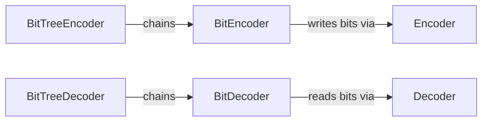

---
digest:
  local-classes:
    BitDecoder:
      mtime: "2026-08-06T06:59:49Z"
      digest: "48f2e8105e9eca4d58352b42f75775223e0491ffaeffcdbcb70d6f7a3affe58b"
    BitEncoder:
      mtime: "2026-08-06T06:59:49Z"
      digest: "1dfbcf0e81559531aafef0e918719857bb6f1f7ba4717a6e0364846770bf026d"
    BitTreeDecoder:
      mtime: "2026-08-06T06:59:49Z"
      digest: "a1b6fa8e50092521efa4da1fa5b0275a87a866dbf0a71923c3b4a02d57db534c"
    BitTreeEncoder:
      mtime: "2026-08-06T06:59:49Z"
      digest: "da7df38a1e8e5d304ef30affa16488a69e771695a9a390865b4f502391ae3906"
    Decoder:
      mtime: "2026-08-06T06:59:49Z"
      digest: "59888211669e95438a888c326dd6d7c5692170dfe4bb4570ee3ceb8b458f9a14"
    Encoder:
      mtime: "2026-08-06T06:59:49Z"
      digest: "9e90f098330dd0f3251427c7dd49a40fba7853e19b7c700d24a5a7787de5656c"
  folders: {}
---
# RangeCoder

This folder provides `Encoder`, `BitEncoder`, `BitTreeEncoder` and related types. `Encoder` arithmetic range coder that serializes a probability-weighted bit   stream into a byte stream, underlying all LZMA symbol encoders.

## Classes

| Class | Responsibility |
|---|---|
| [Encoder](RangeCoder.cs) | Arithmetic range coder that serializes a probability-weighted bit   stream into a byte stream, underlying all LZMA symbol encoders. |
| [Decoder](RangeCoder.cs) | Arithmetic range coder that reconstructs a probability-weighted bit   stream from a byte stream, underlying all LZMA symbol decoders. |
| [BitEncoder](RangeCoderBit.cs) | Encodes a single adaptive binary symbol into a range-coder Encoder,   tracking and updating that bit's probability of being zero. |
| [BitDecoder](RangeCoderBit.cs) | Decodes a single adaptive binary symbol from a range-coder Decoder,   tracking and updating that bit's probability of being zero. |
| [BitTreeEncoder](RangeCoderBitTree.cs) | Encodes a fixed-width symbol as a sequence of adaptive bits walked   down a binary probability tree, most significant bit first. |
| [BitTreeDecoder](RangeCoderBitTree.cs) | Decodes a fixed-width symbol from a sequence of adaptive bits walked   down a binary probability tree, most significant bit first. |

## Architecture

`Encoder`/`Decoder` implement the raw byte-stream arithmetic range coder;
`BitEncoder`/`BitDecoder` layer a single adaptive-probability bit on top of it,
and `BitTreeEncoder`/`BitTreeDecoder` chain several such bits into a binary
probability tree to code a fixed-width symbol. `../LZMA` builds its literal and
length coders directly on the bit-tree layer.

