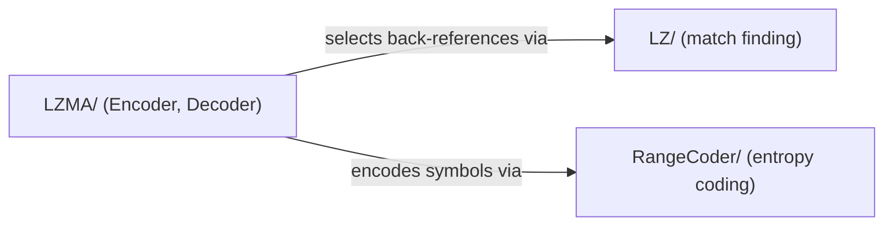

# Compress

Container folder for the vendored LZMA SDK's compression layer; holds no classes
of its own.

## Subsystems

| Folder | Responsibility |
|---|---|
| [`LZ/`](LZ/ReadMe.md) | Sliding-window match finding (`InWindow`, `BinTree`, `OutWindow`) for LZ77-style back-references. |
| [`LZMA/`](LZMA/ReadMe.md) | The LZMA `Encoder`/`Decoder` state machines built on `LZ/` and `RangeCoder/`. |
| [`RangeCoder/`](RangeCoder/ReadMe.md) | Arithmetic range coder and adaptive bit/bit-tree probability models. |

## Architecture

