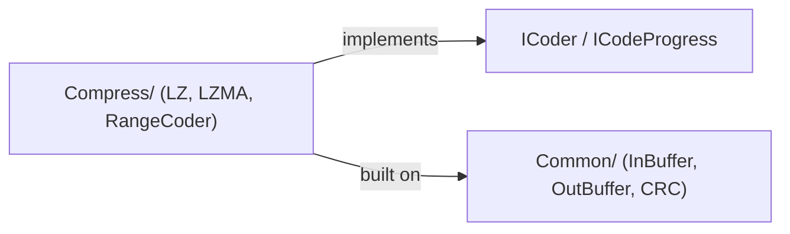

---
digest:
  local-classes:
    CoderPropId:
      mtime: "2026-08-06T07:02:34Z"
      digest: "b3bddf342dfda561777005f4c5504a23222268a333432d73e128252de6cc2eef"
    DataErrorException:
      mtime: "2026-08-06T07:02:34Z"
      digest: "2a54acf601042205aacae5aee63187feb5a00b4bcfccaffaf6aec4c5679c39b4"
    ICodeProgress:
      mtime: "2026-08-06T07:02:34Z"
      digest: "fbb6c8dad66643c6593060e6ff6413d90de67a7ed73d42d1bc7eb0389f24bfa1"
    ICoder:
      mtime: "2026-08-06T07:02:34Z"
      digest: "cb5cbf12d71d7b0f3bd00d2075455a9fa66fcd7a9cd3b8b7cfbb40a8f23e85a7"
    InvalidParamException:
      mtime: "2026-08-06T07:02:34Z"
      digest: "f2d9b2b9b0610d7243ec731a37c174a011116806f0d45f9d64c783653c069468"
    ISetCoderProperties:
      mtime: "2026-08-06T07:02:34Z"
      digest: "1d62cb94a5f66efd6afeb80b87e6af4ab9bcff2eceed3fed088eb20902899356"
    ISetDecoderProperties:
      mtime: "2026-08-06T07:02:34Z"
      digest: "4cf33d8bdde3edb8feb51cfba66727968c5cb3ff777473d5f744eaa0c0503999"
    IWriteCoderProperties:
      mtime: "2026-08-06T07:02:34Z"
      digest: "68dff711fc830bcf85ebf34f7584311772d730b0b73bd97a9efcd8aaeb3bb30e"
  folders: {}
---
# sdk

This folder provides `CoderPropId`, `DataErrorException`, `InvalidParamException` and related types. `CoderPropId` provides the fields that represent properties idenitifiers for compressing.

## Classes

| Class | Responsibility |
|---|---|
| [DataErrorException](ICoder.cs) | The exception that is thrown when an error in input stream occurs during decoding. |
| [InvalidParamException](ICoder.cs) | The exception that is thrown when the value of an argument is outside the allowable range. |
| [ICodeProgress](ICoder.cs) | Callback progress interface. |
| [ICoder](ICoder.cs) | Stream coder interface |
| [ISetCoderProperties](ICoder.cs) | The ISetCoderProperties interface |
| [IWriteCoderProperties](ICoder.cs) | The IWriteCoderProperties interface |
| [ISetDecoderProperties](ICoder.cs) | The ISetDecoderPropertiesinterface |
| [CoderPropId](ICoder.cs) | Provides the fields that represent properties idenitifiers for compressing. |

## Subsystems

| Folder | Domain Role |
|---|---|
| [`Common/`](Common/ReadMe.md) | This folder provides `OutBuffer`, `CRC`, `InBuffer` and related types. |
| [`Compress/`](Compress/ReadMe.md) | Container folder for the vendored LZMA SDK's compression layer; holds no classes of its own. |

## Architecture

`ICoder.cs` defines the vendor-neutral coder contract (`ICoder`, `ICodeProgress`,
the property-based configuration interfaces, and the two checked exceptions) that
`Compress/LZMA`'s `Encoder`/`Decoder` implement. `Common/` supplies the buffered
I/O and CRC primitives that both `Compress/LZ` and `Compress/LZMA` build on.

